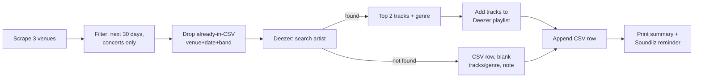

# Gent Concerts Playlist — Design

Date: 2026-08-13

## Goal

A manually-triggered Python CLI tool that, in one run:

1. Scrapes a set of Gent concert venues for concerts happening in the next 30 days.
2. Skips concerts already recorded from a previous run.
3. Looks up each band on Deezer and grabs their top 2 tracks (plus a genre tag).
4. Adds those tracks to a Deezer playlist called "Upcoming Concerts".
5. Appends a row per concert to a tracking CSV.
6. Reminds the user to run the Deezer → Qobuz transfer manually via Soundiiz.

Starting venue set: Missy Sippy Blues Bar, VIERNULVIER, Wintercircus (all Gent). Designed so adding a new venue later is a single new scraper module, not a structural change.

## Why Deezer, not Spotify or the Qobuz API directly

Three services were evaluated for the "look up an artist, get top tracks, build a playlist" step:

- **Qobuz API** — closed/partner-only. No self-service developer access; credentials require emailing `api@qobuz.com` and qualifying as a hardware/software partner. A reverse-engineered path exists (extracting `app_id`/`app_secret` from Qobuz's web player, as tools like `qobuz-dl`/`streamrip` do) but that circumvents Qobuz's access controls — not used here.
- **Spotify Web API** — `GET /artists/{id}/top-tracks` was moved behind Extended Quota Mode as of the February 2026 dev-mode migration. A normal self-registered app in Development Mode is rejected on this specific endpoint, and Extended Quota approval isn't fast/guaranteed for a personal project.
- **Deezer API** — public GET endpoints (search, artist info, artist top tracks) require no auth. Playlist creation/add-tracks needs OAuth via free, self-service app registration at developers.deezer.com. Deezer is a supported **source** service in Soundiiz for transfers into Qobuz.

Net: Deezer is the only one of the three where every step is reachable without special approval or circumventing a vendor's access controls.

## Why the Soundiiz step stays manual

Soundiiz does have an auto-sync feature (configure once: source playlist, destination playlist, "add only" vs "replace", and a daily/weekly/monthly schedule — then it mirrors automatically in the background). However, auto-sync requires a **Premium or Creator** paid Soundiiz plan. Since we're staying on the free tier, the transfer step (soundiiz.com, Deezer → Qobuz, select the playlist, confirm) is done manually by the user after each run. Free tier limit is 200 tracks per playlist transfer, which is not a concern here.

## Venue site notes (as observed 2026-08-13)

- **Missy Sippy** (missy-sippy.be) — homepage lists upcoming shows directly: date, artist name + genre tag, short description, "Register »" link to Eventbrite. All entries are concerts; no category filtering needed.
- **VIERNULVIER** (viernulvier.gent/nl/agenda/muziek) — the `/agenda/muziek` (music) path is already filtered to music events by the site itself. Each entry has artist name, date/time, venue room (Concertzaal, Balzaal, Club Wintercircus, etc.), short description, "Data & tickets" link.
- **Wintercircus** (wintercircus.be/nl/agenda) — general agenda mixes concerts with expos, theatre, etc. Category tags are present (e.g. "concert" vs "Arts & Culture") — the scraper must filter to concert-tagged entries only.

Exact CSS selectors/markup are an implementation detail to confirm while writing each scraper, not part of this design.

## Architecture

```
gent-concerts-playlist/
  scrapers/
    base.py          # shared Concert dataclass + scraper interface
    missy_sippy.py
    viernulvier.py
    wintercircus.py
  deezer_client.py    # search, top tracks, genre lookup, OAuth, playlist ops
  csv_store.py         # read/dedupe/append against concerts.csv
  config.py            # venue list, playlist name, CSV path, window size (30 days)
  main.py               # orchestrates the pipeline, prints summary + Soundiiz reminder
  auth/
    deezer_token.json   # gitignored — saved OAuth access token
  data/
    concerts.csv
```

Adding a new venue later means writing one new module in `scrapers/` implementing the shared interface and registering it in `config.py` — no other changes needed.

## Components

### Scrapers (`scrapers/*.py`)

Each venue module exposes `scrape() -> list[Concert]`, where `Concert` is a dataclass: `venue, date, band, description, ticket_link`. Each scraper is hand-written against that venue's specific HTML (likely `requests` + `BeautifulSoup`) — the three sites share no common markup, so there's no shared scraping abstraction beyond the output shape. Each scraper filters to concert-only entries (a no-op for Missy Sippy and VIERNULVIER's music-only agenda path; an actual filter for Wintercircus's mixed agenda).

### Deezer client (`deezer_client.py`)

- `search_artist(name)` → best-match candidate. Disambiguation: exact (case-insensitive) name match first; if multiple/no exact match, highest `nb_fan`.
- `top_tracks(artist_id, limit=2)` → top 2 tracks.
- `genre_for_artist(artist_id)` → Deezer's artist object has no direct genre field, so this is derived from the top track's album's `genre_id` (via the album lookup), resolved to a genre name.
- OAuth: one-time setup — first run opens the Deezer authorize URL (`connect.deezer.com/oauth/auth.php`) with `perms=basic_access,manage_library`; user approves and the flow captures the resulting token, saved to `auth/deezer_token.json` (gitignored). Later runs load and reuse it until it expires, at which point the flow re-triggers.
- `get_or_create_playlist(title="Upcoming Concerts")`, `add_tracks(playlist_id, track_ids)`.
- A one-time Deezer app registration (developers.deezer.com) is a prerequisite, producing an `app_id`/`app_secret` stored in `.env` (already gitignored).

### CSV store (`csv_store.py`)

Loads `data/concerts.csv`. Columns: `Venue, Date, Band, Music Description, Qobuz Status, Ticket/Event Link`.

- `is_known(venue, date, band)` — dedupe key for skipping concerts already recorded in a previous run.
- `append_row(...)` — adds a new row for a newly-found concert.
- `Music Description` is the Deezer-derived genre tag(s) (e.g. "Blues Rock"), left blank if no Deezer match.
- `Qobuz Status` is written as `Pending transfer` by the script (it cannot know whether the manual Soundiiz step has happened). The user can hand-edit this to `Transferred` after running the Soundiiz transfer.

### main.py (orchestrator)

For each configured venue: scrape → catch and warn on per-venue scraper failure without aborting the run → keep only concerts within the next 30 days → drop concerts already known to the CSV (venue+date+band) → for each new concert, look up the band on Deezer:
- found → top 2 tracks + genre → add tracks to the "Upcoming Concerts" Deezer playlist → CSV row with genre and `Pending transfer`.
- not found → CSV row with blank genre/tracks and a note, concert still recorded (not silently dropped).

At the end: print a run summary (concerts found, tracks added, any no-match artists, any venue scrape failures) and a reminder to do the Soundiiz transfer manually.

## Data flow



## Error handling

- A single venue's scraper failing (site down, markup changed) is caught, logged as a warning, and does not abort the other venues' processing.
- A single artist's Deezer lookup failing (no match, ambiguous, or API error) is non-fatal — falls into the "no match" CSV path, concert is still recorded.
- Deezer auth/network failures (expired/invalid token, API unreachable) are fatal for the run — nothing downstream (playlist writes) can proceed without it, so the run stops with a clear message to re-authenticate.

## Testing

No live test suite runs against the real venue sites or the real Deezer API (fragile, and Deezer needs real OAuth). Instead:

- Unit tests for pure logic: CSV dedupe, the 30-day window filter, artist disambiguation logic.
- Scraper tests run against saved sample HTML fixtures per venue (captured once from the live pages), not live requests.
- Deezer client tests use a mocked client.
- Manual end-to-end run against the real sites/API is how the actual integration gets validated once built.

## Open items for the implementation plan

- Confirm current exact Deezer OAuth scope name for playlist write access (perms list may have changed since research).
- Confirm live against `api.deezer.com` that search + top-tracks truly need no auth (documented as such, not yet verified live in this session).
- Nail down exact CSS selectors for each venue's HTML during scraper implementation.
