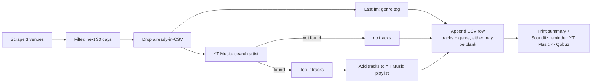

# Gent Concerts Playlist — Deezer to YouTube Music Migration Design

Date: 2026-08-13

Supersedes the Deezer-specific parts of `2026-08-13-gent-concerts-playlist-design.md`. That doc's venue-scraping sections and its rationale for rejecting Spotify/Qobuz still stand; this doc covers why Deezer is also out now and what replaces it.

## Goal

Replace `deezer_client.py` entirely with a YouTube Music-based track/playlist client plus a Last.fm-based genre lookup, so the "search artist → top tracks → add to playlist" and "genre for CSV" steps work without any of the now-blocked provider registrations.

## Why Deezer, Spotify, and Qobuz are all out

- **Deezer** — `developers.deezer.com` is not accepting new app registrations ("We're not accepting new application creation at this time"), confirmed live 2026-08-13. This has apparently been closed for a while, not a transient outage.
- **Spotify** — individual app registration itself is open (confirmed live 2026-08-13), but creating an app now surfaces "Upgrade to Spotify Premium to access the Web API." The project owner does not have Premium and does not want to acquire it, so this path is closed regardless of the pre-existing Extended Quota restriction on `GET /artists/{id}/top-tracks` documented in the original design.
- **Qobuz** — already ruled out in the original design (partner-only access).
- **Tidal, Apple Music, SoundCloud** (other Soundiiz-supported sources) — Tidal and Apple Music have no genuine free tier for this use case (Apple's own API access costs $99/yr); SoundCloud's app registration has been closed to new developers for years, same shape of blocker as Deezer.

## Why YouTube Music

`ytmusicapi` authenticates against the user's own Google account rather than through a formal per-app registration process, so there is no registration gate to hit at all. It is free (no YouTube Premium needed — only search and playlist metadata are used, not streaming), actively maintained, and Soundiiz supports YouTube Music as both a source and a destination, so the manual transfer step becomes YouTube Music → Qobuz instead of Deezer → Qobuz.

**Trade-off, stated explicitly:** this is an unofficial client — it replays the requests the YouTube Music web player itself makes, using an authenticated session, rather than a vendor-sanctioned developer API. The original design explicitly rejected this exact pattern for Qobuz ("circumvents Qobuz's access controls — not used here"). The difference here is practical rather than principled: `ytmusicapi` is a mature, widely-used library (unlike a bespoke Qobuz scraping hack), and it is the only remaining path that is both free and not gated behind a registration process that is currently closed or paywalled. Accepted knowingly, not silently.

## Why Last.fm for genre

YouTube Music's API has no genre field on artists or tracks — `get_artist()` returns no equivalent of Spotify's `genres` list or Deezer's album-genre lookup. Last.fm's `artist.getTopTags` gives a directly analogous "genre-ish tag" for an artist, and Last.fm API key registration is free, instant, and self-service — no approval process, unlike everything else evaluated today.

## Architecture

```
gent-concerts-playlist/
  scrapers/                    # unchanged
  ytmusic_client.py            # search, top tracks, OAuth load, playlist ops
  lastfm_client.py             # genre tag lookup
  csv_store.py                 # unchanged
  filtering.py                 # unchanged
  config.py                    # unchanged
  main.py                      # updated: ytmusic_client + lastfm_client instead of deezer_client
  auth/
    ytmusic_oauth.json         # gitignored — written by `ytmusicapi oauth` CLI, not by our code
  data/
    concerts.csv               # unchanged schema
```

`deezer_client.py` and `tests/test_deezer_client.py` are deleted, not kept dormant — confirmed with the project owner: no config switch to fall back to Deezer if registration reopens.

## Components

### `ytmusic_client.py`

- `search_artist(name: str) -> dict | None` — exact case-insensitive name match preferred; falls back to YT's top-ranked result if no exact match. (No fan-count disambiguation needed like Deezer's — YouTube's own search ranking already surfaces the canonical artist for an exact-name query.)
- `top_tracks(channel_id: str, limit: int = 2) -> list[dict]` — reads the `songs` section of `get_artist(channel_id)`.
- `get_or_create_playlist(title: str) -> str` — checks `get_library_playlists()` for a title match first, creates via `create_playlist()` otherwise. Returns a YouTube Music playlist id (string, not Deezer's int).
- `add_tracks(playlist_id: str, track_ids: list[str]) -> bool` — wraps `add_playlist_items()`. Track ids are YouTube video-id strings.
- Auth: no OAuth flow is implemented in this repo. `auth/ytmusic_oauth.json` is produced once by running `ytmusicapi oauth --client-id <id> --client-secret <secret>` in the terminal (its own device-code flow: opens a browser, user approves, library writes the token cache). Our code only loads that file via `YTMusic(auth=path, oauth_credentials=OAuthCredentials(client_id, client_secret))`. If the file is missing or fails to load, this is a fatal startup error — printed clearly, run stops before any scraping, same fatal-auth stance the Deezer flow had for expired/missing tokens.

### `lastfm_client.py`

- `genre_for_artist(name: str) -> str | None` — `GET https://ws.audioscrobbler.com/2.0/?method=artist.gettoptags&artist=<name>&api_key=<key>&format=json`, returns the top tag's name, or `None` if the artist has no tags. No auth beyond the API key; no cached token.

### `main.py`

Per new concert: call `ytmusic_client` (search → top 2 tracks → add to playlist) and `lastfm_client.genre_for_artist` **independently** — unlike Deezer, where genre was derived from the matched track's album, so a YouTube Music no-match no longer implies a blank genre, and vice versa. Both remain individually non-fatal: no YT Music match → empty track list, concert still recorded with whatever genre Last.fm returned (or blank); no Last.fm tag → blank `Music Description`, tracks still added if found. The Soundiiz reminder text changes from "Deezer → Qobuz" to "YouTube Music → Qobuz".

## Data flow



## Error handling

- Per-venue scraper failure: unchanged (caught, logged, doesn't abort other venues).
- Per-artist YT Music no-match: non-fatal, concert recorded with empty track list.
- Per-artist Last.fm no-tag: non-fatal, `Music Description` left blank.
- Missing/invalid `auth/ytmusic_oauth.json` at startup: fatal, run stops before scraping with a message telling the user to re-run `ytmusicapi oauth`.

## Testing

- `tests/test_ytmusic_client.py` — injects a fake client object with stub `search`/`get_artist`/`create_playlist`/`get_library_playlists`/`add_playlist_items` methods (not `requests` mocking, since `ytmusicapi` is a client class rather than bare HTTP calls).
- `tests/test_lastfm_client.py` — mocks `requests.get` via the existing `fake_response` fixture in `tests/conftest.py`, same style as the old Deezer tests.
- `tests/test_main.py` — updates its mocks from `_lookup_deezer` to the new (separate) YT Music and Last.fm lookup calls, plus a new case for the decoupled "genre found, no track match" (and vice versa) scenarios.
- Scraper tests/fixtures for the 3 venues: untouched.
- No live network in automated tests. Manual end-to-end run remains the way OAuth and the real APIs get validated, same as the original design's Testing section.

## Migration / file changes

- Delete: `deezer_client.py`, `tests/test_deezer_client.py`.
- Add: `ytmusic_client.py`, `lastfm_client.py`, `tests/test_ytmusic_client.py`, `tests/test_lastfm_client.py`.
- Modify: `main.py` (swap Deezer imports/calls for the two new clients), `tests/test_main.py`, `.env.example` (`YTMUSIC_OAUTH_CLIENT_ID`, `YTMUSIC_OAUTH_CLIENT_SECRET`, `LASTFM_API_KEY` replace the two Deezer vars), `.gitignore` (`auth/ytmusic_oauth.json` replaces `auth/deezer_token.json`), `README.md` (setup steps: Google Cloud OAuth client + `ytmusicapi oauth` command + free Last.fm key; Soundiiz reminder text).
- Untouched: `config.py`, `csv_store.py`, `filtering.py`, all 3 venue scrapers and their tests/fixtures.

## Open items for the implementation plan

- Confirm live against `ytmusicapi` which exact `get_artist()` response shape holds top songs (field names may drift between library versions).
- Confirm the exact Google Cloud Console steps to create a free "TV and Limited Input devices" OAuth client for `ytmusicapi oauth` — verify live rather than relying on documentation that may be stale, the same way the original plan verified Deezer/venue facts live rather than guessing.
- Confirm Last.fm's `artist.gettoptags` response shape and behavior for an artist with zero tags (empty list vs missing key).
